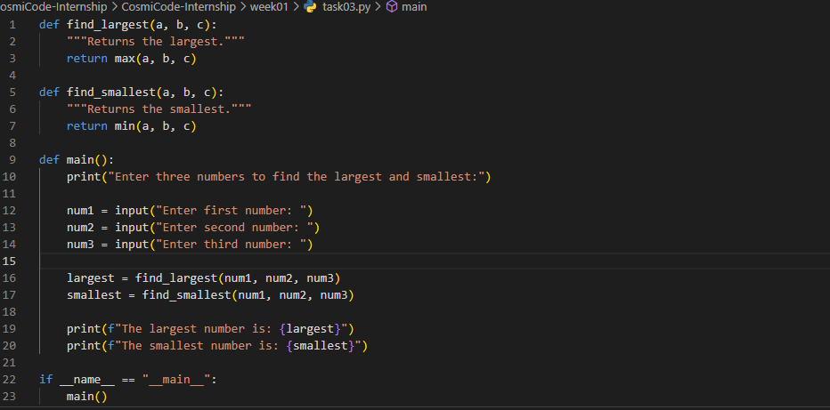

# CosmiCode-Internship

Virtual Internship doing Python Development

# Week 01 Tasks - CosmiCode Internship

## ✅ Tasks Covered

- Task 1: Use "Print" to Display Hello World in Output
- Task 2: Create functions of modulo and power and main function and get familiar with conditions like if and elif
- Task 3: Understand the variables and Data-types in Python and how to take inputs
- Task 4: Datatype conversions Understand the variables and Data-types in Python and how to take inputs

---

## 📸 Screenshots

### Task 1

### Task 2

### Task 3

### Task 4

