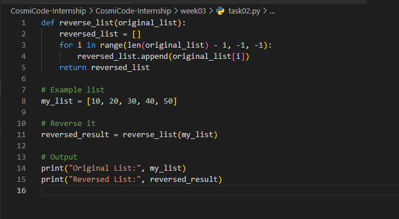
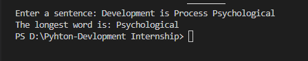

# CosmiCode-Internship

Virtual Internship doing Python Development

# Week 03 Tasks - CosmiCode Internship

This repository contains 5 beginner-level Python programs designed to build foundational programming skills. Each task focuses on a specific concept such as recursion, list manipulation, string processing, and file handling.

---

## 🔧 Tasks Overview

### ✅ Task 1: Merge Sort Implementation

**Description:**  
Implements the merge sort algorithm to sort a list of integers using the divide-and-conquer approach.

**Key Concepts Used:**

- Recursion
- List slicing
- Manual merging of sorted halves

**What It Does:**

- Recursively splits the list into smaller sublists
- Merges them back in sorted order

---

### ✅ Task 2: Reverse a List (Without Built-in Functions)

**Description:**  
Reverses a list of integers without using built-in methods like `.reverse()` or slicing `[::-1]`.

**Key Concepts Used:**

- For loop (reverse iteration)
- List indexing
- Appending elements manually

**What It Does:**

- Iterates from the last to the first element
- Builds a new reversed list

---

### ✅ Task 3: Longest Word in a Sentence (Ignore Punctuation)

**Description:**  
Finds the longest word in a user-provided sentence while ignoring punctuation and case.

**Key Concepts Used:**

- `string.punctuation`
- `str.translate()` for removing punctuation
- `split()` and `len()` to process words

**What It Does:**

- Cleans the sentence
- Finds and prints the longest word

---

### ✅ Task 4: Palindrome Checker (Ignore Spaces and Case)

**Description:**  
Checks if a string is a palindrome, ignoring spaces and case sensitivity.

**Key Concepts Used:**

- `str.lower()`
- `split()` and `join()` to remove spaces
- String slicing `[::-1]` for reverse comparison

**What It Does:**

- Cleans and normalizes the string
- Compares it to its reverse

---

### ✅ Task 5: Most Frequent Word in a Text File

**Description:**  
Reads a text file and identifies the most frequent word, ignoring punctuation and case.

**Key Concepts Used:**

- `open()` and file reading
- `str.translate()` + `string.punctuation` cleanup
- Dictionary for word frequency
- `max()` with `key` to find the top word

**What It Does:**

- Reads text from a file
- Cleans and tokenizes it
- Prints the most frequent word and its count

---

## 📸 Screenshots

### Task 1

.png>)
.png>)

### Task 2

### Task 3

### Task 4

## Task05

.png>)
.png>)

