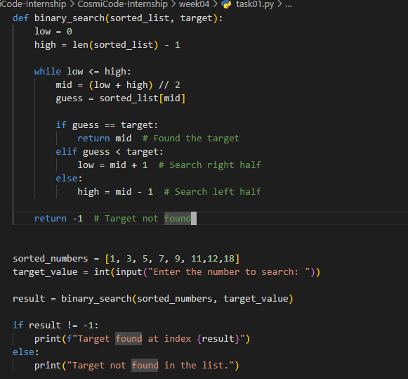
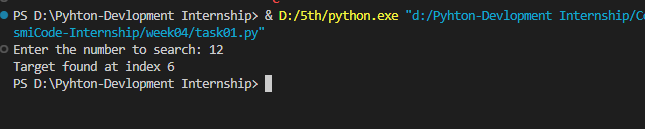
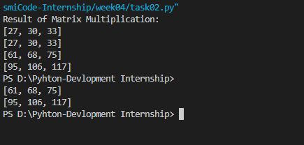
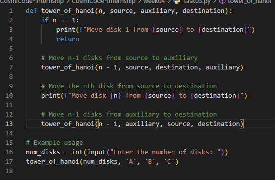
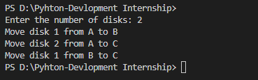
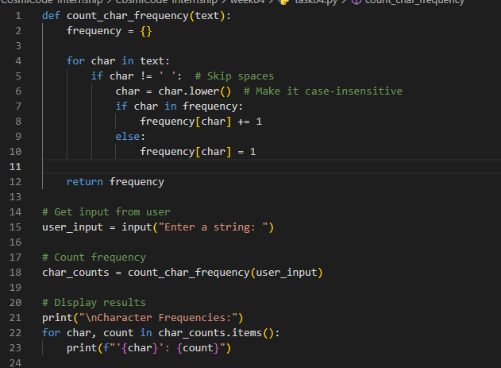
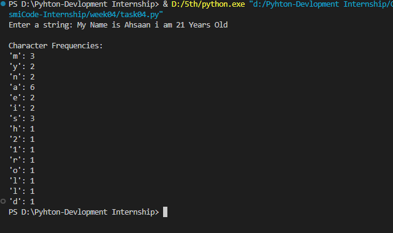
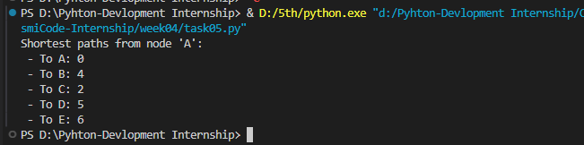

# 📘 Week 04 README: Data Structures & Algorithms Tasks

This repository contains five fundamental programs that implement classic algorithms and data structure applications in Python. Each task focuses on understanding core problem-solving strategies such as recursion, greedy algorithms, dictionaries, and graph traversal.

---

### 🔢 1. Tower of Hanoi (Recursive Solution)

**📝 Description:**  
Solves the classical **Tower of Hanoi** problem using recursion. It prints the steps needed to move disks from the source rod to the destination rod using an auxiliary rod.

**🧠 Algorithm:**

- **Tower of Hanoi (Recursive)**
- Recursive divide-and-conquer approach

**⚙️ Concepts Used:**

- Recursive function calls
- Base condition and recursive steps
- Stack-like call structure

**✅ How Solved:**

- We defined a recursive function that moves disks to the auxiliary rod, moves the nth disk to the destination, then moves the disks from the auxiliary rod to the destination. This visualizes and breaks the problem down logically.

---

### 🔠 2. Character Frequency Counter Using Dictionary

**📝 Description:**  
Counts the frequency of each character in a given string using Python dictionaries.

**🧠 Algorithm/Concept:**

- Frequency Counting using Hash Map (Dictionary)

**⚙️ Concepts Used:**

- Dictionary data structure
- String traversal
- Case-insensitive counting
- Space and punctuation exclusion

**✅ How Solved:**

- We used a dictionary to map each character to its count. We ignored spaces and made the string lowercase to count characters uniformly.

---

### 🧭 3. Dijkstra’s Algorithm – Shortest Path in a Graph

**📝 Description:**  
Finds the shortest path from a source node to all other nodes in a weighted graph using **Dijkstra’s Algorithm**.

**🧠 Algorithm:**

- **Dijkstra’s Algorithm (Greedy)**

**⚙️ Concepts Used:**

- Graphs (adjacency list)
- Priority Queue (`heapq`)
- Greedy approach
- Path cost tracking

**✅ How Solved:**

- We initialized distances to infinity, used a min-heap to extract the next shortest node,
  and updated neighbor distances based on edge weights—efficiently managing the graph traversal.

---

### 📚 4. Matrix Multiplication (Without NumPy)

**📝 Description:**  
Multiplies two matrices manually using nested loops, without using built-in libraries.

**🧠 Algorithm/Concept:**

- Matrix multiplication rules (Row × Column)

**⚙️ Concepts Used:**

- Nested loops
- 2D lists (matrix representation)
- Validation for dimensions

**✅ How Solved:**

- We used triple nested loops to compute each cell of the resulting matrix by summing the product of corresponding elements
  from row and column positions.

---

### 🔍 5. Binary Search – Find Element in Sorted List

**📝 Description:**  
Searches for a target value in a sorted list using the efficient **Binary Search** technique.

**🧠 Algorithm:**

- **Binary Search (Divide and Conquer)**

**⚙️ Concepts Used:**

- Recursion or iterative mid-point checking
- Sorted list traversal
- Low-high pointer technique

**✅ How Solved:**

- We implemented binary search using a while loop. We repeatedly divided the search space by checking the middle element and adjusting the search bounds accordingly.

---

## 📌 Summary of Techniques Used

| Task                  | Technique/Algorithm    | Key Python Features                 |
| --------------------- | ---------------------- | ----------------------------------- |
| Tower of Hanoi        | Recursion              | Function calls, stack-like behavior |
| Character Frequency   | Hashing                | Dictionary, string operations       |
| Dijkstra’s Algorithm  | Greedy, Priority Queue | heapq, dictionaries                 |
| Matrix Multiplication | Nested Loops           | Lists, conditionals                 |
| Binary Search         | Divide & Conquer       | Loops, mid-point logic              |

---

## 📸 Screenshots

### Task 1

### Task 2

### Task 3

### Task 4

## Task05

.png>)
.png>)

---

## 🧑‍💻 Author

**Muhammad Ahsaan**  
CosmiCode Internship – Week 04 Tasks  
[GitHub Repo Link](https://github.com/codewithahsaan/CosmiCode-Internship)
